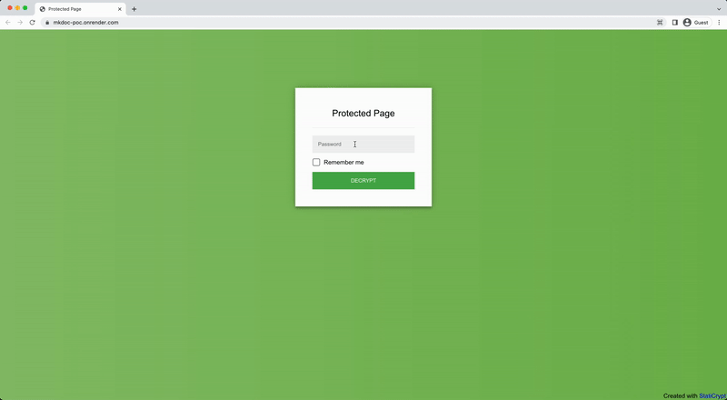

# Static Website generated by MkDocs with password encryption



This repository showcases a minimal integration POC that combines the following elements:

- Documentation generation using [MkDocs](https://www.mkdocs.org/).
- Protect the generated HTML files with [staticrypt](https://github.com/robinmoisson/staticrypt).
- Host the resulting website on render.com.

We host the resulting website on the following [URL](https://mkdoc-poc.onrender.com/). Please have a look!
The password is `hello`.

## Documentation generation

We made a simple two-page documentation using MkDocs.
You can check the documentation locally by running the following command from the root of the repository:

```shell
cd docs
mkdocs serve
```

The [deploy][deploy] script uses the `mkdocs build` command to generate the HTML, CSS, and Javascript files under `docs/site`.

## Encrypt the generated HTML content

We use `staticrypt` to encrypt in place all the HTML content located in the generated documentation files, as shown in the [deploy][deploy] script.

```shell
find . -type f -name "*.html" -exec npx staticrypt {} $SECRET -o {} \;
```

The above snippet uses the `SECRET` environment variable to define the password that will be used for later authentication, so make sure to specify this environment variable in the environment where you will run the [deploy script][deploy]!

## Build and deploy on render.com

You can then use render.com to host your static website for free.
We do not provide detailed explanations, but the process is relatively straightforward.

Just make sure that:

1. You correctly set up your `SECRET` environment variable to the password of your choice.
2. You set up the build process to launch each time the documents under the `docs` folder are updated.
3. You use `bash deploy.sh` as the command for your build.

And voila!
You should be able to access the documentation on your public URL.

[deploy]: deploy.sh
